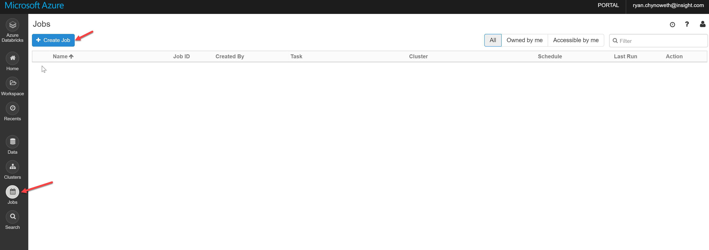
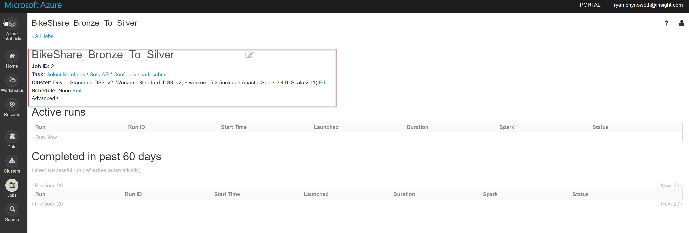

# Transforming Bronze Tables in Silver Tables

Our data is fairly clean an requires very little transformations to get it properly formatted for our silver tables. The entire idea of silver tables is to apply the minimum transforms and a little business logic to create readable tables that can be joined and summarized for consumption in gold. 

In this section of the demo we will process both our streaming and our batch data. 

## Stream Data 

One of my most favorite features of Databricks Delta and Delta Lake is the ability to use them as both streaming sources and streaming sinks. This means we can have a stream read a table and process new data as it appears! It really takes the idea of real-time processing to the next level by building in this integration without the need for a queuing service (i.e. EventHub or Kakfa).

1. Create a [`02a_StreamBronzeToSilver`](../code/02a_StreamBronzeToSilver.py) notebook.

1. First lets use the `readStream` function to load our IoT data, and display it. Run the following code in a python notebook.     
    ```python
    from pyspark.sql.functions import col
    # Read a stream from delta table
    streamDF = spark.readStream.format('delta').load("/mnt/delta/bronze/iot/stream_data")

    display(streamDF)
    ```

1. Databricks actually allows users to view data in real-time via their built in plotting capabilities. I would play around with it and see what you can do!  
    
 
1. Our ultimate goal here is to stream our data, apply transformations, and stream it to our silver tables. If we stop, the command above and execute the one below we will acheive that goal. In this case we are simply formating our timestamp into a readable format.  
    ```python
    streamDF = (spark.readStream.format('delta').load("/mnt/delta/bronze/iot/stream_data")
    .withColumnRenamed("timestamp", "raw_timestamp")
    .withColumn("Timestamp", (col("raw_timestamp")/1000).cast("timestamp")) )
    ```

1. Now we will write our data stream into our silver delta table. Since Apache Spark is a lazy execution engine, we don't actually trigger an action until we use the `writeStream` function.  

    ```python
    (streamDF
    .writeStream
    .format("delta")
    .option("checkpointLocation", "/delta/checkpoints/iot/stream_data") #allows us to pick up where we left off if we lose connectivity
    .outputMode("append") # appends data to our table
    .start("/mnt/delta/silver/iot/stream_data") ) 
    ```

    There are a few components here that I would recommend when using delta.  
    - **Always use checkpoints**: Checkpoints allow you to pick up a stream where you left off if your cluster shuts down or you lose connectivity to data sources.  
    - **Store checkpoints in a single location**: Organize the checkpoints by job i.e. we use `/iot/stream_data` from our delta table path and add it to the `/delta/checkpoints` path.  
    -  **Use similar filepaths**: You will notice that the only difference in our bronze and silver paths is the words "silver" and "bronze". 
    - **Explicity State the OutputMode**: it is important to know if you want to overwrite, append, or fail if data already exists. 


We have now started streaming job that consumes a stream from our bronze tables, applies a few transforms, and streams it to our silver delta table.  


## Batch Data

Now we want to work with our batch data. Batch data is the most common form of data processing I see in organizations. When it comes to processing and transferring our data from bronze to silver we have a few different options.  
- **Stream**: We can turn our batch data into a stream similar to how we are simulating a stream. 
- **Chain Notebooks**: [Notebook Workflows](https://docs.databricks.com/user-guide/notebooks/notebook-workflows.html) allow developers to easily execute a notebook from another notebook. Therefore, we can kick off another job after another one finishes. 
- **Schedule Separately**: Similar to the source to bronze tables process where we have a cron job, we can simply schedule another cron job to run the bronze to silver jobs. 


The most common choice is to chain your notebooks. Organization typically want to keep their batch jobs in bronze to be batch into silver and gold as well. Keeping them as batch jobs allows organizations to reduce cost by running a few number of jobs at a time and scheduling them at different times on a smaller cluster or being able to have the cluster turn off in between executions, therefore, starting a stream would be prohibative to this goal. Scheduling a bronze to silver job on a schedule would work, but is less ideal because we may mistime our processing so that there is no new data to process. Chaining notebooks would immediately kick off a second job once new data is available, therefore, would be on somewhat the same cron job as the source to bronze.  

In this section of the demo we will go through each process listed above. Please note that the notebook and python file for this section of the demo only contains the chain notebook code.   

### Stream Batch Bronze Data to Silver
To stream data our bike share data from bronze to silver execute the following code.  
```python
bikeShareDF = spark.readStream.format('delta').load("/mnt/delta/bronze/bikeSharing/daily")

(bikeShareDF
 .writeStream
 .format("delta")
 .option("checkpointLocation", "/delta/checkpoints/bikeSharing/daily") 
 .outputMode("append")
 .start("/mnt/delta/silver/bikeSharing/daily") )
```


### Chain Notebooks
First, lets build out the batch data pipeline from bronze to silver for our batch data. 

1. Create a notebook called [`02b_BatchBronzeToSilver`](../code/02b_BatchBronzeToSilver.py).  

1. Load, transform, and write our hourly data.
```python

```

1. Load, transform, and write our daily data.
```python

```


When chaining notebooks we will have a "master" notebook that executes each notebook in our pipeline. 

1. Create a [BikeSharePipeline](../code/BikeSharePipeline.py) python notebook.  

1. Use the following code to run our batch source to bronze notebook. Please note that the `0` value is a `timeout_in_seconds` argument, this values ensures that we do not timeout.    
    ```python
    dbutils.notebook.run("01b_BatchSourceToBronze", 0)
    ```

1. Use the following code to run our batch bronze to silver notebook.  
    ```python
    dbutils.notebook.run("02b_BatchBronzeToSilver", 0)
    ```

1. Use the following code to run our silver to gold notebook. This command won't work quite yet but it will once we create the notebook!  
    ```python
    dbutils.notebook.run("03b_BatchSilverToGold", 0)
    ```

Please note that if you have workbooks that you would like to return and pass values or objects between you can use the `dbutils.notebook.exit("returnValue")` command. Additionally, now that we have a data pipeline of 3 notebooks we are able to schedule this `BikeSharePipeline` notebook to run each notebook serially. An alternative option would be to paste the `dbutils.notebook.run` at the end of each notebook to execute, however, I prefer to have a dedicated notebook to call each one to create a notebook hierarchy that is easy to manage.     

### Schedule Notebook 
This process is the same to schedule all jobs inside of a Databricks workspace, therefore, for this process you would have to schedule separate notebooks that: 
- Source to bronze
- Bronze to silver
- Silver to gold

1. Naviagate to the jobs tab in Databricks


1. Then provide the values to schedule the job as needed.  
